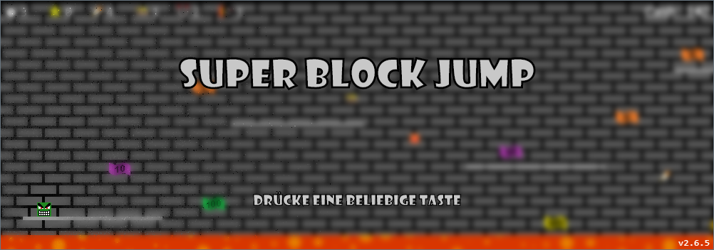

Super Block Jump ist ein in Javascript geschriebenes Jump'n'Run-Spiel, welches das Canvas-Element von HTML benutzt.

##Spielprinzip

Der Spieler ist ein Rechteck, welches von Plattform zu Plattform springt. Fällt er in die Lava, ist die Runde vorbei. Aus der Lava springen ab und zu kleine Feuerbälle, die bei Berührung auch die Runde beenden.
Während der Runde gibt es auf dem Weg Geldscheine und Items, die aufgesammelt werden können. Die Geldscheine können im Shop gegen neue Charaktere oder Itemupgrades verwendet werden.

##Shop

Das Spiel besitzt einen kleinen Shop, in dem neue Charaktere und Itemupgrades gekauft werden können. Die Charaktere haben zusätzliche Fähigkeiten, wie verbesserte Sprungkraft oder schnellere Bewegung. Bei den Items kann durch die Upgrades die Dauer verlängert werden.
Falls die Items dadurch zu lange halten, können diese auch wieder gedowngraded werden, was jedoch ebenfalls Geld kostet. Die Währung in dem Spiel heißt Hype .

##Achievements

Ebenfalls besitzt das Spiel Achievements, die verschiedene Bereiche des Spiels abdecken. Bei besonders schweren Achievements gibt es bei Abschließung zusätzliche Charaktere.

##Speicherstände

Das Spiel unterstützt das Speichern von Speicherständen. Diese werden jedoch aufgrund von Sicherheitseinstellungen nicht innerhalb des Browsers gespeichert, sondern werden in die Zwischenablage zum externen Abspeichern gelegt. Sie können ebenfalls über die Zwischenablage geladen werden.

ACHTUNG! Bei neuladen des Tabs ist der Speicherstand verloren, deswegen immer speichern!

##Highscores

Um besser seine Highscores verfolgen zu können, sind diese einsehbar, wobei nur die besten 100 Einträge gespeichert werden. Sie sind geordnet nach Distanz und nach gesammeltem Geld.

##Steuerung

Die Standardsteuerung liegt auf den WASD-Tasten und den Pfeil-Tasten, kann aber frei angepasst werden.

##Spielen

Um das Spiel zu starten muss die HTML-Datei geöffnet und anschließend auf den "Start"-Knopf gedrückt werden. Danach ist die Steuerung ausschließlich über die Tastatur.

##Support

Das Spiel läuft in allen modernen Browsern, in Edge ab Version 14.